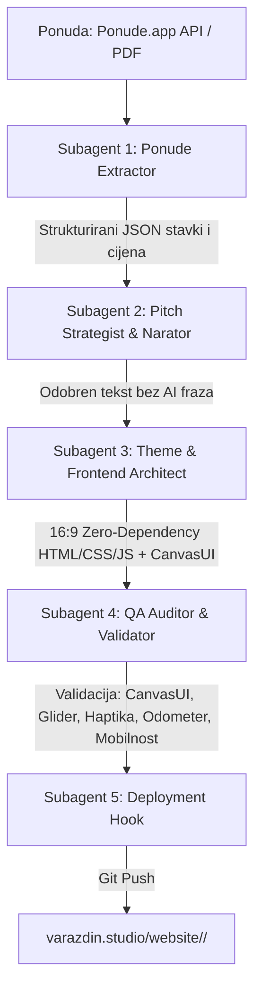

# AGENTS.md — Operativni sustav za prezentacijske mikrosajtove (varazdin.studio)

Ovaj dokument je **zakon za razvoj interaktivnih prezentacijskih mikrosajtova i pitch deckova** koji se izrađuju za klijente, povezuju s ponudama iz `Ponude.app` i objavljuju pod domenom **`varazdin.studio`**.

Svaki agent (glavni orkestrator, strateg, tekstopisac, frontend inženjer, motion dizajner, QA auditor) obvezan je pročitati i primijeniti ova pravila prije i tijekom rada.

---

## 1. Svrha i tehnički standardi prezentacijskih mikrosajtova

Prezentacijski mikrosajtovi predstavljaju najviši rang digitalne komunikacije s klijentima:
- **Kinematografsko, interaktivno iskustvo:** Zamjenjuje statične PDF prezentacije živim web-deckom koji radi savršeno i na 4K konferencijskim ekranima i na mobilnim uređajima.
- **Povezanost sa stvarnim ponudama:** Svaki mikrosajt je izravno mapiran na ponudu iz `Ponude.app` (ili odgovarajući PDF u `Ponude/`), osiguravajući točnost cijena, stavki, zakonskih klauzula i rokova.
- **Zero-Dependency Vanilla arhitektura:** Isključivo čisti HTML5, CSS3 i moderni ES6+ JavaScript. Nema npm paketa, nema React/Vue overheada, nema vanjskih build koraka koji bi mogli zastarjeti ili puknuti.
- **Instantno učitavanje i 60fps:** Sve animacije i prijelazi moraju biti hardverski ubrzani (`transform: translate3d/scale`, `opacity`).
- **Puna samostalnost:** Cjelokupan mikrosajt funkcionira unutar jedne mape (`website/<slug>/`), spreman za cPanel Git deployment.
- **Zabrana automatske reprodukcije (No Autoplay):** Prezentacijom upravlja isključivo korisnik (tipkovnica, klik, gesta). Nema autoplay gumba niti automatskih tajmera koji preskaču slajdove.
- **Službeni kontakt e-mail:** U svim pitch prezentacijama, predlošcima i mailto linkovima koristi se isključivo `timon.terzic@gmail.com`.

---

## 2. Hosting i Deployment Arhitektura (`varazdin.studio`)

### A. Struktura mapa
Svi mikrosajtovi organizirani su unutar repozitorija `varazdin.studio`:
```
varazdin.studio/
├── .cpanel.yml                 # Automatska skripta za cPanel deployment
├── website/                    # Izvorna web mapa
│   ├── index.html              # Glavna stranica studija
│   │
│   ├── <client-slug>/          # PREZENTACIJSKI MIKROSAJT KLIJENTA
│   │   ├── index.html          # Glavni interaktivni deck (samostalan)
│   │   ├── assets/             # Slike visoke razlučivosti, logo, video, fontovi, PDF ponude
│   │   └── api/                # Opcionalni mikro-PHP endpointi (npr. vote.php, feedback.php)
```

### B. Deployment protokol (.cpanel.yml)
Nakon svakog `git push` na repozitorij `timon2200/varazdin.studio`, cPanel deployment hook izvršava:
```yaml
---
deployment:
  tasks:
    - export DEPLOYPATH=$HOME/public_html/
    - /bin/cp -R website/* $DEPLOYPATH
```
**Live URL klijenta:** `https://varazdin.studio/<client-slug>/` (npr. `https://varazdin.studio/meridian16/` ili `https://varazdin.studio/komunalni-projekt/`).

---

## 3. Dizajnerski sustav i palete tema

Svaki mikrosajt prilagođava paletu i tipografiju brendu i industriji klijenta, ali zadržava besprijekoran autorski potpis Studio Varaždin:

### A. Tipografski sustavi (Google Fonts)
1. **Modern Editorial / Brutalist Tech (Standard za komercijalne filmove i inovacije):**
   - Headings: `'Syne', sans-serif` (700/800/900) ili `'Unbounded', sans-serif` (800/900)
   - Body: `'Plus Jakarta Sans', sans-serif` (500/700/800)
   - Data / Badges / Code: `'JetBrains Mono', monospace` (700/800)
2. **Luxury Storytelling / Dark Immersive (Standard za adventske i kulturne projekte):**
   - Headings: `'Playfair Display', serif` (700/900)
   - Body: `'Inter', sans-serif` (300/400/500/600)
3. **Clean Eco-Utility / Studio Minimal (Standard za komunalne, javne i održive projekte):**
   - Headings: `'Syne', sans-serif` (800/900)
   - Body: `'Plus Jakarta Sans', sans-serif` (500/700)
   - Accents / Tags: `'JetBrains Mono', monospace` (700)

### B. Palete tema (CSS Varijable)
- **1. Clean Eco-Studio & Utility (`eco-utility`):**
  ```css
  :root {
    --bg-canvas: #f2f7f4;
    --bg-card: #ffffff;
    --bg-card-subtle: #e6f1ec;
    --text-primary: #0d1815;
    --text-secondary: #2d3f3a;
    --text-muted: #647a74;
    --border-dark: #0d1815;
    --border-color: #c4d7cf;
    --accent-green: #0d5c3a;
    --accent-green-bright: #10b981;
    --accent-green-bg: #e0f6eb;
    --accent-green-border: #a1dcc2;
  }
  ```
- **2. Topla urednička paleta (`editorial-canvas`):**
  ```css
  :root {
    --bg-canvas: #f4efe4;
    --bg-card: #fbf7ee;
    --bg-card-subtle: #eae3d2;
    --text-primary: #111518;
    --text-secondary: #3b454e;
    --text-muted: #79828a;
    --border-dark: #111518;
    --border-color: #d5ccba;
    --accent-green: #11421f;
    --accent-green-bright: #177331;
    --accent-green-bg: #e1ede4;
  }
  ```
- **3. Studio Varaždin Dark Luxury (`dark-luxury`):**
  ```css
  :root {
    --bg-canvas: #171E19;
    --bg-card: #1f2722;
    --text-primary: #F5EFE3;
    --accent-gold: #D0A041;
    --accent-gold-bright: #F6CF65;
    --accent-oxblood: #4E110C;
    --border-dark: #2c362f;
  }
  ```

---

## 4. Komponente i interaktivni mehanizmi (Obvezna matrica)

Svaki prezentacijski mikrosajt mora implementirati sljedeći set mikro-interakcija:

### 1. Fiksna 16:9 pozornica i mobilna responzivnost
- **Desktop:** Fiksni 16:9 omjer (`aspect-ratio: 16 / 9; max-height: calc(100vh - 135px);`), savršeno centriran s 2px brutalist obrubom i taktilnom sjenom (`box-shadow: 8px 8px 0px rgba(13, 24, 21, 0.16)`).
- **Mobile (< 768px):** 
  - Automatski prelazak pozornice u fluidni scroll feed bez fiksnog omjera.
  - Svi slajdovi (1 do 6) koriste **apsolutno ograničeni skrolajući kontejner** (`position: absolute; top:0; left:0; right:0; bottom:0; overflow-y: scroll; -webkit-overflow-scrolling: touch; overscroll-behavior-y: contain; padding: 1rem 0.85rem 4rem 0.85rem;`).
  - Sve mreže (`.grid-2col`, `.grid-3col`, `.dual-offers-grid`, `.offer-package-grid`, `.slide-actions-grid`) prelaze u vertikalni stupac (`flex-direction: column; width: 100%; height: auto;`).
  - Ništa ne smije biti odrezano niti nedostupno za skrolanje.

### 2. Centrirani Liquid Morphing Pill Indikator
- Paginacijska traka u podnožju je **apsolutno fiksirana u središtu ekrana** (`left: 50%; transform: translate(-50%, -50%)`), čime se sprječava bilo kakvo pomicanje pri promjeni naslova slajda na lijevoj strani.
- Glider kapsula (`.nav-pill` / `.slide-dot.active`) izvodi smjerno stiskanje i rastezanje (`@keyframes squishForward` / `squishBackward`) s glatkim sheen svjetlosnim sweepom.
- Pregledani slajdovi zadržavaju decentnu toniranu boju (`.visited`).

### 3. Micro-Interaction Hover Tooltips
- Lebdeće kartice iznad svakog indikatora koje pri prelasku mišem prikazuju redni broj `[ 0X ]` i puni naslov slajda uz elastični opružni easing.

### 4. Precision Odometer Rolling Counter
- Brojač slajdova (`01 / 06`) s vertikalnom rotacijom pojedinačnih znamenki (`roll-up` / `roll-down`) sinkroniziranom s prijelazom slajda.

### 5. Zero-Dependency Audio Haptics (Web Audio API)
- Sintetizirani mehanički klik frekvencijskog raspona `1100Hz -> 320Hz` (naprijed) i `850Hz -> 300Hz` (natrag), bez vanjskih zvučnih datoteka. Uključivanje/isključivanje tipkom `M` ili gumbom u navigaciji.

### 6. Taktilni Keyboard & Gesture kontroler
- Navigacija tipkovnicom (`←` / `→`, `Space`, `Enter`, `PageUp` / `PageDown`, `1`–`6`, `F` za fullscreen, `M` za zvuk).
- Pritiskom na tipkovničke strelice, gumbi na ekranu (`btnPrev`, `btnNext`) vidljivo se utiskuju (`transform: translate(2.5px, 2.5px)`).

### 7. CanvasUI Ambijentalne Čestice (`#canvasUiParticles`)
- Fiksno pozadinsko platno (`canvas#canvasUiParticles`) sa z-indexom iza sadržaja (`z-index: 2`).
- 45 mikro-čestica koje lebde s prirodnim Brownian šumom, blago bježe od kursora miša (repulsion radijus 120px) i dobivaju snažno horizontalno ubrzanje vjetra (`triggerCanvasUiWind`) pri svakoj promjeni slajda.

### 8. CanvasUI Bayer Dither Leća (Retro Dither)
- 4x4 Bayer dithering efekt pri prelasku mišem preko video kartica i vizualnih okvira, stvarajući prepoznatljiv analogni Studio Varaždin vizualni potpis bez dodatnih biblioteka.

### 9. CanvasUI 3D WebGL Cloth & Dynamic Physics Engine (Slajd 5)
- **Zero-Dependency WebGL2 Arhitektura:** 96×96 mreža (18.432 trokuta) s fizikom valova i prigušenja, difuznim sjenčanjem, spekularnim svjetlom i SDF obrezivanjem.
- **Direct 2D Canvas Rasterizacija:** Teksture za kartice opcija (npr. Option A i Option B) renderiraju se u memoriji preko 2D `OffscreenCanvasa` u dvostrukoj rezoluciji (`dpr: 2`) i prosljeđuju u `gl.texImage2D` u 0ms, čime se eliminiraju CORS i SVG blokade.
- **Signature Dark Green Styling za Preporučenu Opciju (Option B):**
  - Pozadina: `#0d1815` (duboka antracit/zelena)
  - Obrub: `#10b981` (emerald green) s brutalist sjenom `6px 6px 0px var(--accent-green)`
  - Značka: `#10b981` pozadina s tamnim tekstom `#0d1815` i bijelim obrubom
  - Zvjezdice: `★` u `#10b981` / `#7de095`
  - Donji boks s cijenom: `#13231e` sa zelenim akcentnim tekstom
- **Graceful Mobile Fallback:** Na mobilnim uređajima (`< 768px`) WebGL platno se skriva (`display: none`), a prikazuje se čisti, savršeno čitljivi HTML element (`.offer-box`), osiguravajući 100% responzivnost bez usporavanja.
- **Sigurnosni lifecycle:** `MutationObserver` aktivira WebGL i `resize()` točno u trenutku prijelaza na slajd 5, uz Zero-Size Guard (`w < 30px`) koji sprječava rušenje na skrivenim slajdovima.

### 10. Obvezni PDF Download i Autorizacijski blok (Slajd 6)
- **Dvostruka ili pojedinačna preuzimanja ponuda:**
  - **Za ponude s više opcija:** `.pdf-download-grid` s dva odvojena brutalistička gumba — Option A (`.btn-pdf-download`) i Option B (`.btn-pdf-download.signature-dl`).
  - **Za pojedinačne ponude:** Veliki hero gumb (`.btn-pdf-hero`) s A4 specifikacijom i iznosom.
- **Gumb za direktnu autorizaciju / prihvat ponude (`.btn-auth-hero` / `.btn-auth-action`):** Otvara pripremljenu e-mail poruku prema `timon.terzic@gmail.com` za potvrdu projekta i rezervaciju termina snimanja.
- **Izdavatelj i pravni podaci studija (`.issuer-footer-meta` / `.contact-grid`):** Navedeni u podnožju slajda.

---

## 5. Dizajnerski manifest i standardi copywritinga

Svaki prezentacijski mikrosajt mora zadovoljiti najviši estetski i urednički standard:

### A. Bespoke vizualni identitet i besprijekoran craft (Konzistentno izvrstan dizajn)
- **Nema generičkih predložaka:** Svaka prezentacija ima specifičan vizualni karakter prilagođen industriji i brendu klijenta (arhitektura palete, tipografski ritam, teksture i detalji).
- **Visoka kreativnost i autorski potpis:** Hrabar kontrast, pažljivo kalibriran whitespace, taktilni brutalistički ili editorial obrubi, savršeno poravnanje i mikro-tipografija (`letter-spacing`, `line-height`, hijerarhija).
- **Hardverska glatkoća:** Sve interakcije i mikro-animacije moraju raditi u fluidnih 60fps bez zastoja.

### B. Kondenzirane poruke i funkcionalan copy (High-Signal / Zero Fluff)
- **Bez uljepšavanja i kićenja:** Izbaciti svaki oblik dekorativnog teksta, uvodnog filozofiranja i praznih marketinških fraza.
- **Funkcionalan radni tekst:** Klijent u 3 sekunde čitanja mora shvatiti točnu vrijednost, format, proces i rezultat. Tekst mora biti operativan, tehnički točan i izravan.
- **Jedna kristalna teza po slajdu:** Svaki slajd komunicira točno jednu ključnu poruku, potkrijepljenu konkretnim brojkama, deliverablima ili komparacijama.
- **Stroga zabrana AI klišeja:** Bez iznimke izbaciti sve AI formulacije (*zaronite u, otkrijte čaroliju, predstavlja pravi dragulj, kamen temeljac, bogata povijest, jedinstveno iskustvo, spoj tradicije i suvremenosti, oaza mira, ostavlja bez daha, svjedoči o*).
- **Glagoli umjesto pridjeva:** Izbaciti prazne superlative (*prekrasan, revolucionaran, vrhunski*). Opisati radnju, mehanizam i materijalni rezultat.
- **Smještaj činjenice:** Jedna činjenica po odlomku, smještena u **sredinu**, nikad na sam kraj (kraj pripada slici ili akciji).
- **Bez sažetaka:** Zabranjen zaključni odlomak koji ponavlja već rečeno.

### C. Narativna struktura pitcha (6 slajdova)
- **Slajd 1:** Hrabra teza i kontrast (Stari pristup vs. Naš pristup).
- **Slajd 2:** Narativna arhitektura / Scenarij i tehnologija.
- **Slajd 3:** Formati za sve kanale (1 Master 4K + 3 Vertikale za mreže).
- **Slajd 4:** Edukativna ili poslovna metodologija.
- **Slajd 5:** Komercijalni paketi i transparentna ponuda (s 3D CanvasUI tkaninama).
- **Slajd 6:** Terminski plan, PDF download opcije i autorizacijski CTA.

---

## 6. Protokol roja agenata i automatizirani alati

Za automatsku izradu novog prezentacijskog mikrosajta koristi se ugrađeni Python orkestrator i 5 specijaliziranih uloga:



### Struktura repozitorija i alata (Agent-First Modular Architecture):
```
Ponude/
├── AGENTS.md                                   # Ovaj dokument (operativni protokol)
├── deck_engine/                                # DIJELJENI CORE ENGINE ZA SVE DECKOVE
│   ├── core/
│   │   ├── css/                                # variables.css, base.css, header.css, footer.css, components.css, modal.css, mobile.css
│   │   ├── js/                                 # audio.js, odometer.js, modal.js, particles.js, cloth.js, navigation.js
│   │   └── templates/
│   │       ├── layout.html                     # Master HTML kostur s placeholderima (CanvasUI integriran)
│   │       └── default_slides/                 # 01_hero.html ... 06_auth.html
│   └── themes/                                 # eco-utility.json, editorial-canvas.json, dark-luxury.json
│
├── scripts/
│   ├── build_deck.py                           # BRZI COMPILER (deck.json + slides/*.html -> index.html)
│   ├── orchestrate_presentation.py             # Master CLI orkestrator (Ekstrakcija + Scaffolding + Build + QA)
│   ├── fetch_ponuda.py                         # Ekstrakcija ponude iz API-ja ili PDF-a
│   ├── generate_deck.py                        # Generator modularnog workspacea s CanvasUI modulima
│   └── validate_deck.py                        # QA auditor usklađenosti
│
├── Meridian16_Prezentacija/                    # MODULARNI WORKSPACE KLIJENTA
│   ├── deck.json                               # Metapodaci, cijene, kontakt e-mail, popis slajdova
│   ├── slides/                                 # POJEDINAČNI ATOMSKI SLAJDOVI (30-50 linija svaki)
│   │   ├── 01_hero.html
│   │   ├── 02_concept.html
│   │   ├── 03_formats.html
│   │   ├── 04_production.html
│   │   ├── 05_offer.html
│   │   └── 06_auth.html
│   ├── custom.css                              # Stilovi kartica, signature box (#0d1815) i download mreže
│   ├── custom.js                               # WebGL cloth teksture (2D high-DPR rasterizacija)
│   ├── index.html                              # Kompajlirani samostalni zero-dependency HTML
│   └── slike/ / assets/                        # Slike i službeni PDF-ovi
│
├── Komunalni_Prezentacija/                     # (Modularni workspace za Grad Varaždin & Čistoću)
└── ...
```

### Agent-First Uređivanje & Automatizirane naredbe:

#### 1. Uređivanje postojećeg pitch decka:
- **Izmjena teksta ili kadra:** Agent otvara samo ciljanu datoteku, npr. `Meridian16_Prezentacija/slides/02_concept.html`.
- **Izmjena cijene ili e-maila:** Agent mijenja vrijednosti u `deck.json`.
- **Recompilation & Deploy:**
  ```bash
  # Kompajlira i automatski postavlja na varazdin.studio:
  python3 /Users/timonterzic/Documents/Ponude/scripts/build_deck.py Meridian16_Prezentacija --deploy

  # Watch mod za rad uživo dok agent piše slajdove:
  python3 /Users/timonterzic/Documents/Ponude/scripts/build_deck.py Meridian16_Prezentacija --watch --deploy
  ```

#### 2. Izrada novog pitch decka iz PDF-a ili Ponude.app:
```bash
python3 /Users/timonterzic/Documents/Ponude/scripts/orchestrate_presentation.py \
  "/Users/timonterzic/Documents/Ponude/Naziv_Ponude.pdf" \
  --slug "klijent-slug" \
  --theme "eco-utility"
```

#### 3. QA Audit usklađenosti:
```bash
python3 /Users/timonterzic/Documents/Ponude/scripts/validate_deck.py "/Users/timonterzic/Documents/Ponude/Meridian16_Prezentacija/index.html"
```


